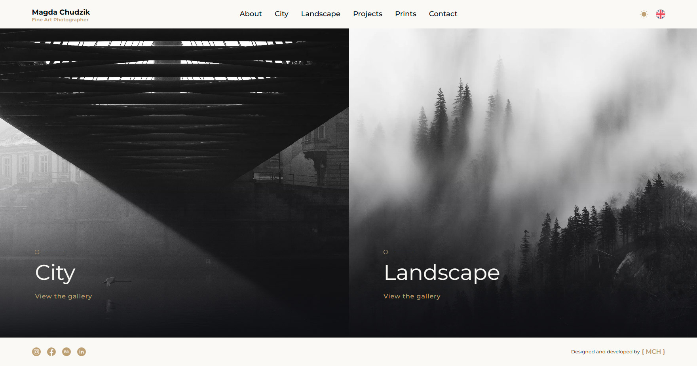
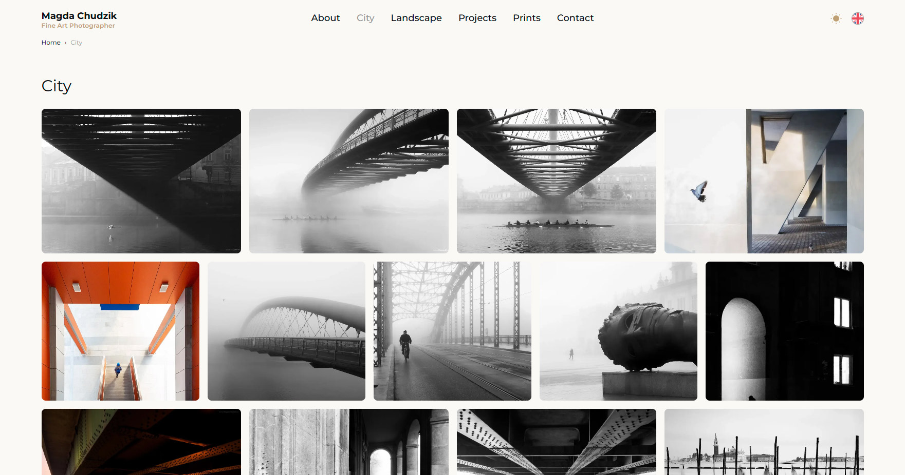
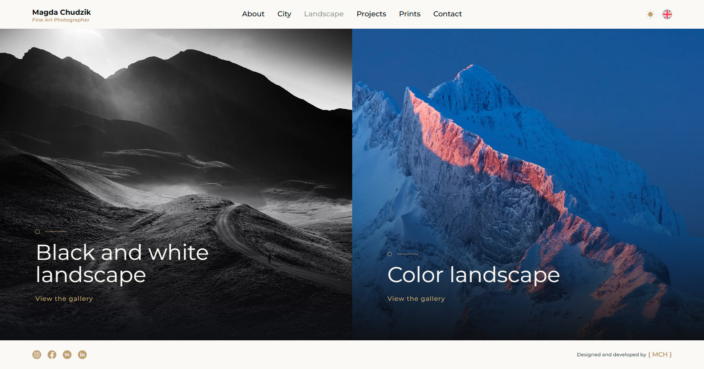
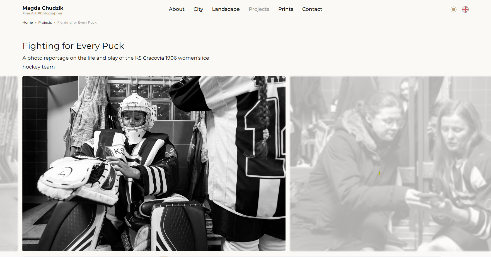
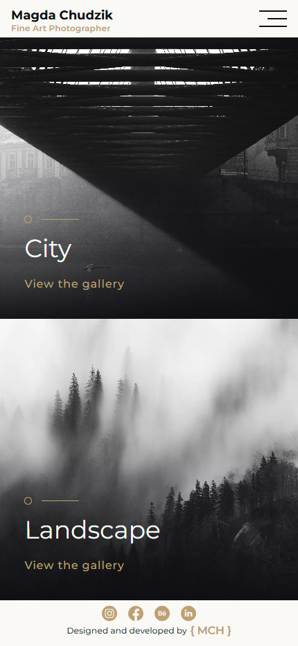
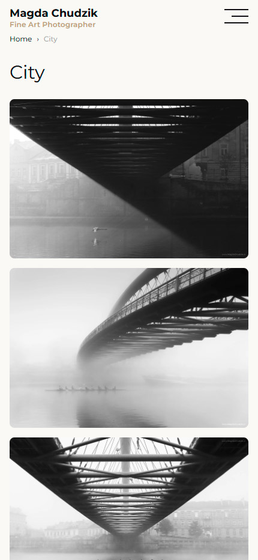
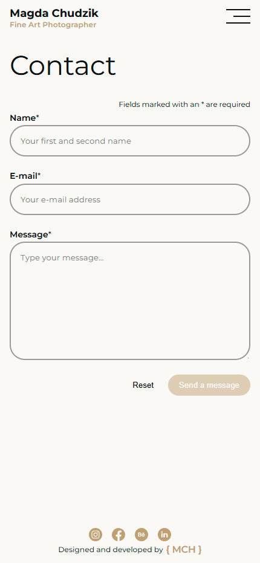

# Photographer's Portfolio

A statically generated photography portfolio built with React and React Router. The website presents the photographer's work through immersive galleries and a responsive, performance-focused interface designed to keep attention on the photographs.

## Scope

- Front-end development
- UI/UX design

## Technology stack

React, React Router, Vite, TypeScript, SASS, PHP, Sharp, Static Site Generation.

## Live demo

[magdachudzik.pl](https://www.magdachudzik.pl)

## Getting Started

### Installation

Install the dependencies:

```bash
npm install
```

### Development

Start the development server with HMR:

```bash
npm run dev
```

Your application will be available at `http://localhost:5173`.

## Building for Production

Create a production build:

```bash
npm run build
```

## Mockups

[](./public/images/readme/mockup1.webp)

[](./public/images/readme/mockup2.webp)

[](./public/images/readme/mockup3.webp)

[](./public/images/readme/mockup4.webp)

<table>
	<tr>
		<td></td>
		<td></td>
		<td></td>
	</tr>
</table>
